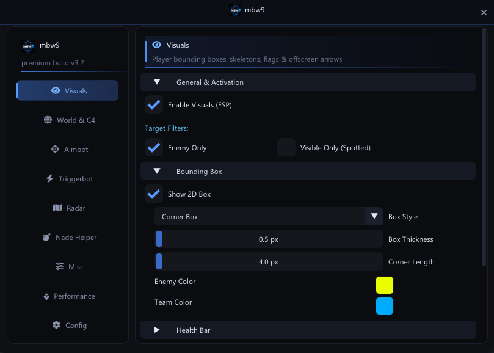

# mbw9 — CS2 External Cheat (Premium Build v3.2)

External CS2 cheat with DirectX 11 overlay + ImGui, NTAPI memory reads, and a premium dark menu.

## Download

1. Download all files from this repository (or clone it):
   - `External.exe` — the cheat
   - `fa-solid-900.ttf` — icon font (required for menu)
   - `LOGO.png` — menu logo (required)
2. Place all three files in the **same folder**.

## Requirements

### System
- **OS**: Windows 10 (1903+) or Windows 11 (x64 only)
- **CPU**: x64 processor (AVX2 recommended for best performance)
- **GPU**: DirectX 11 compatible (any GPU from 2012+)
- **RAM**: 4 GB minimum

### Software
- **Counter-Strike 2** installed and running
- **Steam** logged in
- **Administrator privileges** required (to access CS2 process memory via NTAPI)

### Files
All three files must be in the **same folder**:
| File | Required | Purpose |
|------|----------|---------|
| `External.exe` | Yes | The cheat binary |
| `fa-solid-900.ttf` | Yes | FontAwesome icon font for the menu UI |
| `LOGO.png` | Yes | Logo displayed in the menu header and sidebar |

### Notes
- No additional drivers or DLLs needed — the cheat uses direct NTAPI syscalls (`NtReadVirtualMemory`) from usermode
- No Visual C++ Redistributable needed — the binary is statically linked (`/MT`)
- The overlay uses `WDA_EXCLUDEFROMCAPTURE` — it is invisible to screen recording/streaming software (OBS, Discord, etc.)
- Windows Defender may flag the exe — add an exclusion if needed

## Usage

1. Place `External.exe`, `fa-solid-900.ttf`, and `LOGO.png` in the same folder.
2. Launch **Counter-Strike 2** and enter the main menu.
3. Right-click **`External.exe`** → **Run as administrator**.
4. Press **`INSERT`** to open/close the menu.
5. Configure features from the menu tabs.
6. Join a game and enjoy.

### Menu Controls
| Key | Action |
|-----|--------|
| `INSERT` | Toggle menu |
| `ALT` (default) | Triggerbot hotkey |
| Mouse drag | Move menu / radar / bomb panel |

## Features

### Visuals (ESP)
- 2D bounding boxes (full / corner style) with per-team colors
- Health bars (dynamic color, configurable position & thickness)
- Skeleton with bone thickness, head dot, shadow background
- Player text: name, distance, active weapon, C4 carrier badge, flashed badge
- Snaplines and offscreen arrows
- Pixel-level offset customization for every element

### World & C4
- Draggable bomb panel HUD (explosion timer, defuse timer with kit status, SAFE/NOT SAFE damage indicator)
- Planted C4 3D badge with site (A/B) and timer
- Dropped C4 badge
- Dropped weapons (name, distance, ammo) with offscreen map indicators
- Grenade warnings and projectile tracking (offscreen arrows)
- Hostages and map objects

### Aimbot
- Hitbox targeting (Head / Neck / Chest / Pelvis)
- FOV circle with smoothing
- Recoil Control System (RCS) with strength, smoothing, and shot threshold
- Legit humanization (acquisition delay, micro jitter, speed variance)
- Pro Player Humanize v2 (overshoot, reaction variance, deceleration)
- Target velocity prediction
- Silent Aim (pSilent engine) with 3D sphere FOV, tick sync, and prediction

### Triggerbot
- Crosshair-based auto-fire
- Hotkey support
- Humanized delays (min/max random)
- Auto pistol rapid fire
- Burst fire mode (count, delay)

### Radar
- External 2D radar window (draggable, resizable)
- Player blips with names, direction cones, health colors
- Deathmatch mode, smooth blip movement
- Configurable zoom and scan range

### Grenade Helper
- Saved grenade lineup spots (per map, per grenade type)
- Trajectory prediction
- Import/export spots from file

### Misc
- Auto Bunny Hop with auto strafe
- Sniper crosshair overlay
- No Flash (configurable alpha)
- Spectator list
- Stream proof (overlay excluded from screen capture)

### Performance
- Per-tick entity cache (125 Hz, seqlock-protected)
- Entity chunk cache (eliminates redundant reads)
- Class name cache
- VSync toggle
- NTAPI batched memory reads

Full feature list: [feature.md](feature.md)

## Support

If you need help or want to report a bug, join our Discord:

### [Join Discord](https://discord.gg/A34uD5RKa)

## Disclaimer

This software is for educational purposes only. Use at your own risk.
